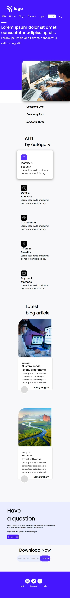
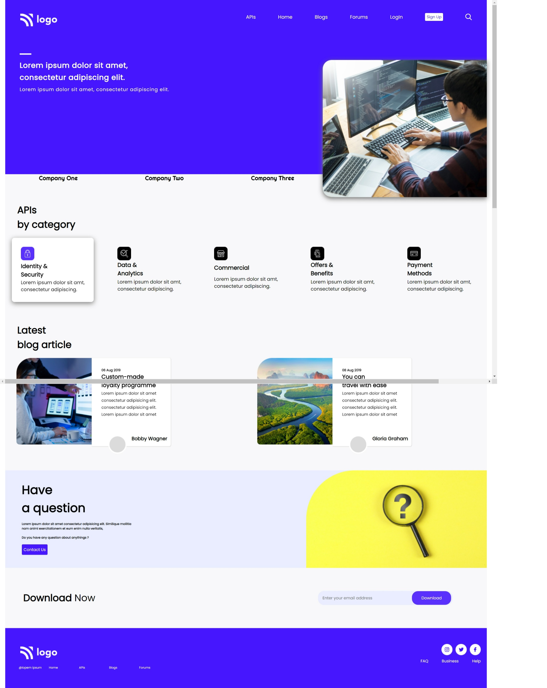

# 
**Project 09 - Developer Landing Page**

> ## Topics learnt in this project
- understood use of grid little more in dept
- working with large html pages
- working on section wise structring of html page
- learnt to use Effects - drop shadow 
   

> ## Time to complete this project 
> # **8 Hrs**

## **By : Kalpesh K Dhotre**
 

## [🌏 Deployed link](https://kd-project-09.netlify.app/)

 

## Below is screenshot of Mobile View & [Click here large screen view.](#large-screen-view)

 

 

# Large Screen View

 

## 
 [Back to top](#centerproject-09---developer-landing-pagecenter)
